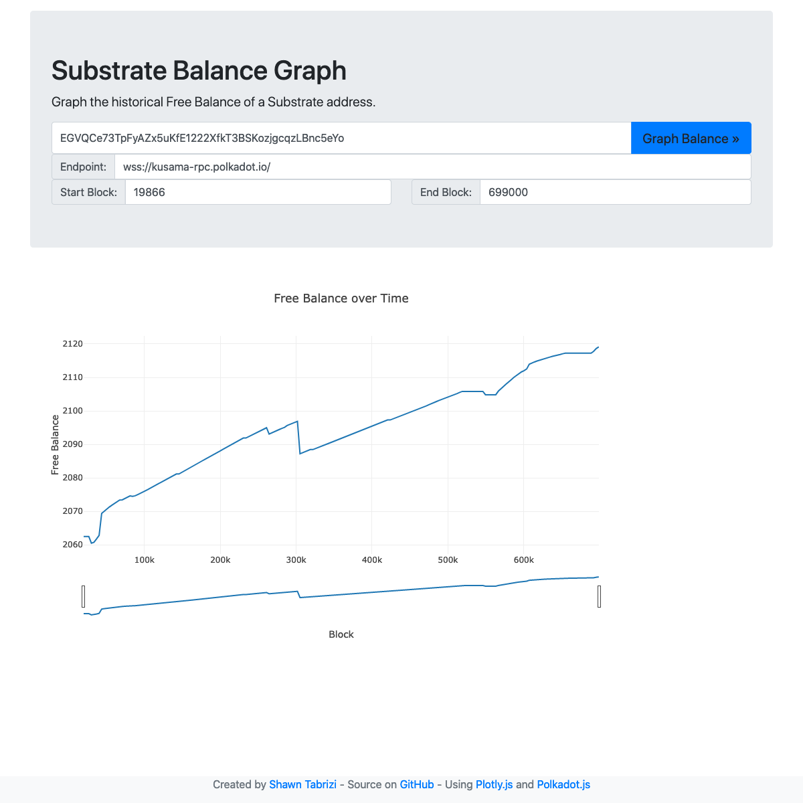

# Substrate-Balance-Graph
Create a graph of the free balance over time of a Substrate address

You can play with this app here: [http://shawntabrizi.com/substrate-balance-graph/](http://shawntabrizi.com/substrate-balance-graph/)

Blog post: https://www.shawntabrizi.com/substrate/porting-web3-js-to-polkadot-js/

Built by repurposing: https://github.com/shawntabrizi/ethgraph
